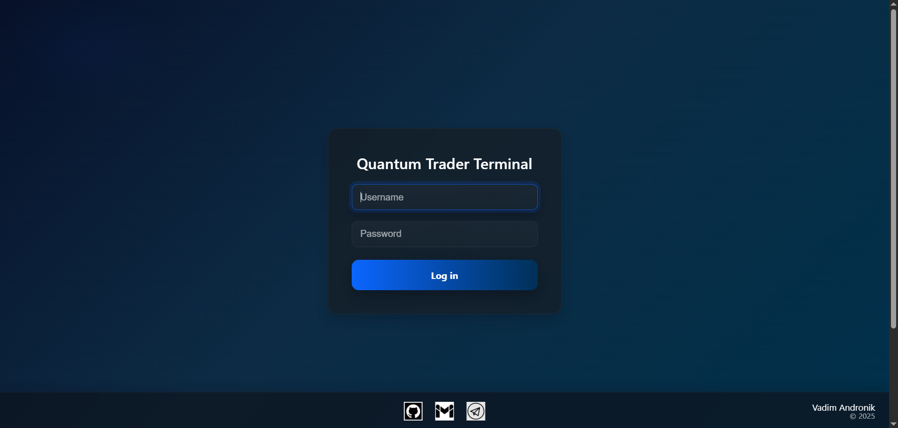
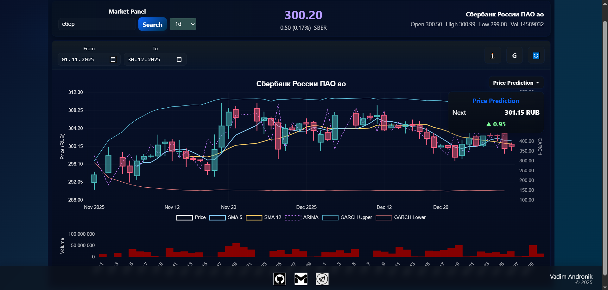

# Quantum Trader Terminal

A trading terminal focused on market analysis and price forecasting using technical indicators and statistical models.

## Description

The project visualizes asset price charts, calculates **SMA(5)** and **SMA(12)** indicators, and applies **GARCH** and **ARIMA** models to forecast the next time unit (e.g., the next candle). These forecasts and indicator signals help inform trading decisions.

The application features a user-friendly dashboard with charts, indicators, and predictions. In the current version, only authentication is implemented — additional settings (model parameters, exchange connections, etc.) are not yet available and will be added in future updates.

## Technologies

### Backend
- Rust

### Frontend
- React
- TypeScript

## Interface

### Main View: Chart and Analysis Dashboard
- **Interactive price chart** for the selected period (with zoom in/out support)
- Display of **SMA(5)** and **SMA(12)** lines
- Markers for SMA crossover signals (e.g., golden/death cross)
- Forecast for the next time unit using **GARCH** and **ARIMA** models
- Convenient sidebar showing current indicator values, model outputs, and recommendations

### Authentication
- Login screen

### Upcoming Features (in development)
- Trade history
- Trading bot selection and launch
- Settings (API tokens, themes, model parameters)

---
## Screenshots

### Authentication Screen

### Main Data Screen
